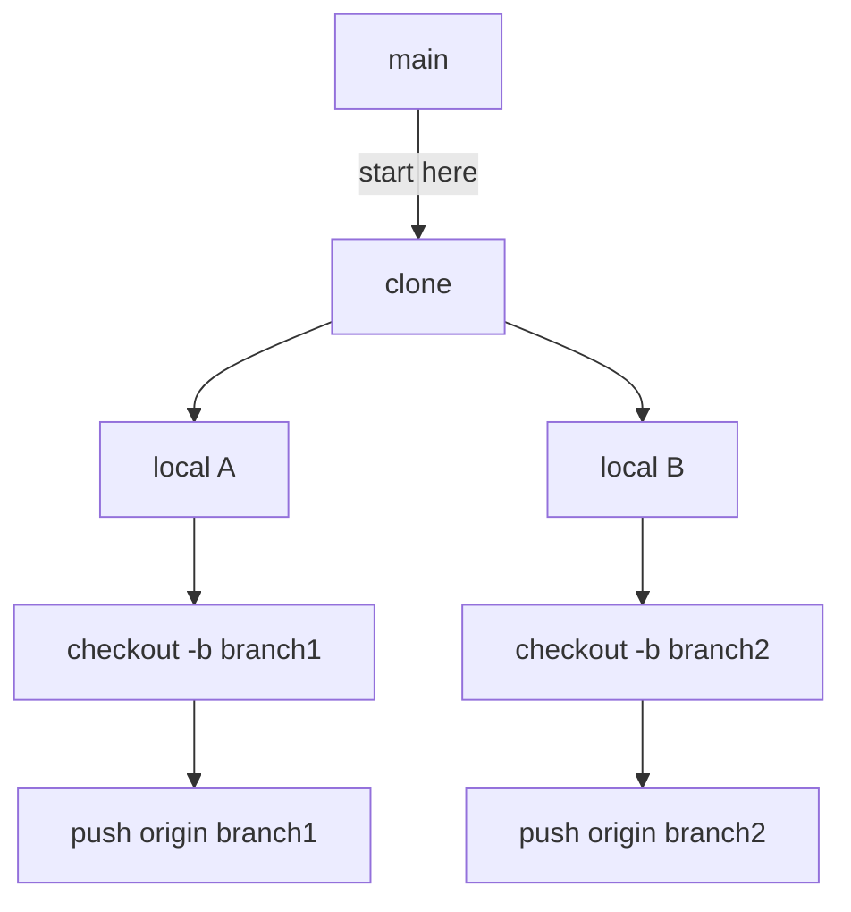

## Starting The Game

1. clone repositori ini:

```bash
git clone https://github.com/mzmunechika/javascript_for_beginners.git

# Jika anda menggunakan ssh:
git clone git@github.com:mzmunechika/javascript_for_beginners.git
```

2. buat branch baru dengan nama anda, contoh:

```bash
git checkout -b rie
```

3. kerjakan soalnya

## How to learn from here (Cara belajar dari sini)

Langsung aja mulai dari [sini](./day_1/1_get_started.md)

## Flow (Alur)

`main` :

- variable.js `(soal)`
- data_types.js `(soal)`
- array.js `(soal)`
- comments.js `(soal)`
- ...

```bash
git clone https://github.com/some_repo
```

---

`your_branch1` :

```bash
git checkout -b your_branch1
```

- variable.js `(jawaban b1)`
- data_types.js `(jawaban b1)`
- array.js `(jawaban b1)`
- comments.js `(jawaban b1)`
- ...

```bash
git push origin your_branch1
```

---

`your_branch2` :

```bash
git checkout -b your_branch2
```

- variable.js `(jawaban b2)`
- data_types.js `(jawaban b2)`
- array.js `(jawaban b2)`
- comments.js `(jawaban b2)`
- ...

```bash
git push origin your_branch2
```


